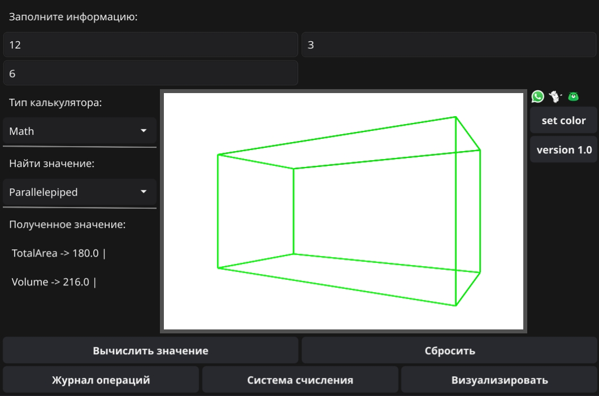

# Material-Analytics3D
Интерактивный физико-математический ассистент для вычисления величин (объём, площадь, периметр и др.) с визуализацией 3D-моделей фигур и графиков. Решает задачу наглядного изучения и проверки расчётов, объединяя вычислительный инструмент с визуальным представлением объектов.



## Содержание
- [Технологии](#технологии)
- [Начало работы](#начало-работы)
- [Тестирование](#тестирование)
- [To do](#to-do)

## 🛠 Технологии
- [Go](https://go.dev/)
- [Fyne](https://fyne.io/)
- [PostgreSQL](https://www.postgresql.org/)
- [Testify](https://github.com/stretchr/testify)
- [Golang-migrate](https://github.com/golang-migrate/migrate)

## Использование
Клонируйте репозиторий:
```sh
$ git clone https://github.com/north-fy/Material-Analytics3D
$ cd ./Material-Analytics3D
```

### Настройки

Настройте базу данных вручную, либо же через миграцию:
```sh
$ migrate -path ./migrations -database "postgres://localhost/NAME?sslmode=disable&password=PASSWORD" up
```

Создайте переменную окружения "config.yaml" в корне проекта и заполните по шаблону:
```yaml
database:
  host: "localhost"
  user: ""
  password: ""
  sslmode: "disable"

app:
  app-height: 500.0
  app-width: 750.0
  name: "Material-Analytics3D"
  fixed-size: true
```

## Разработка

### Требования
Go версии 1.18 или выше

PostgreSQL версии 12 или выше

Компилятор C


### Установка зависимостей
Для установки зависимостей, выполните команду:
```sh
$ go mod download
```

### Сборка билда
Чтобы выполнить windows build сборку, выполните команду:
```sh
$ make
```

Для других платформ, выполнять по build-macos или build-linux:
```sh
$ make build-linux
```

## Тестирование
Тесты написаны с помощью testify. Для запуска unit-tests выполните команду:
```sh
$ make test
```

Для отслеживания покрытия выполните:
```sh
$ make cover-test
```

## To do
- [x] Основная логика работы программы
- [x] Работа с драйвером pq
- [ ] Тесты на calculator 
- [ ] Тесты на application + render
- [ ] Тесты на repository
- [ ] Деплой CI/CD & Docker